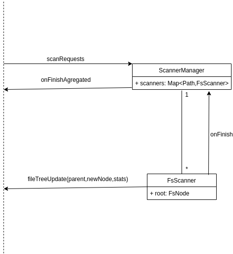

# Scanner
Disk scanning module
## Asynchronous computation model
Based on coroutines communicating using channels.

### ScannerManager
Main coroutine, keeps track of all currently running scans.

**Channels**
* input 
    * from outside - requests for new scans - executed only if necessary, scans on child nodes of current node cancelled
    * from inside -  onFinish notifier -> forwards the notification + adds info how many more scans are running
* output
    * aggregated finish info
    
### FsScanner
Coroutine handling one subtree scan. Receives a file node to start from when created.

**Channels**
* input - none, file already specified as input param
* output - 
    * for outside - fileTreeUpdates -> which node should be added where + statistics about current search
    * for inside - notify ScannerManager when finished + stats 
    
    